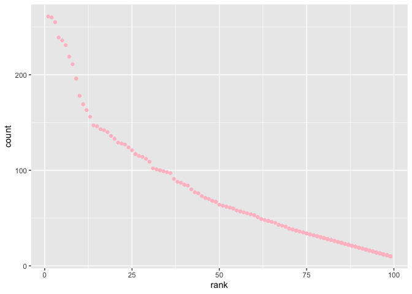

p8105\_hw2\_jl5549
================

Problem 1

``` r
#import Mr Trash Wheel dataset
mr_trash_wheel = 
  read_excel( './data/Trash-Wheel-Collection-Totals-8-6-19.xlsx', 
                            sheet = 'Mr. Trash Wheel',range = ) %>% 
  janitor::clean_names() %>% 
  select(-15,-16,-17) %>% 
   drop_na() %>% 
 #filter(is.na((mr_trash_wheel) == 0)
  #filter(!is.na(dumpster)) %>% 
  mutate(sports_balls = round(sports_balls), 
         sports_balls = as.integer(sports_balls))
```

    ## New names:
    ## * `` -> ...15
    ## * `` -> ...16
    ## * `` -> ...17

``` r
#import percipitation datasets for 2017 and 2018
prcp_2017 = 
  read_excel('./data/HealthyHarborWaterWheelTotals2018-7-28.xlsx', 
                            sheet = 4, skip = 1) %>% 
  janitor::clean_names() %>% 
  drop_na(total) %>% 
  mutate(year = '2017')
prcp_2018 = 
  read_excel('./data/HealthyHarborWaterWheelTotals2018-7-28.xlsx', 
                            sheet = 3, skip = 1) %>% 
  janitor::clean_names() %>% 
  drop_na(total) %>% 
  mutate(year = '2018')

#combine two datasets
prcp = 
  rbind(prcp_2017, prcp_2018) %>% 
  mutate(month = month.name[as.integer(month)])
```

The number of the observations of first dataset is 344. This dataset
includes variables of dumpster number(dumpster), date of
collection(year, month, date), amount of total litter(weight\_tons) and
litter type(weight\_tons, sports\_balls etc). The number of the
observations of the second dataset is 21. This dataset includes
variables of precipitation amounts and associated dates(month, year).
The total precipitation in 2018 is 23.5. The median number of sports
balls in a dumpster in 2017 is 8. The example is show as below.

``` r
head(mr_trash_wheel)
```

    ## # A tibble: 6 x 14
    ##   dumpster month  year date                weight_tons volume_cubic_ya…
    ##      <dbl> <chr> <dbl> <dttm>                    <dbl>            <dbl>
    ## 1        1 May    2014 2014-05-16 00:00:00        4.31               18
    ## 2        2 May    2014 2014-05-16 00:00:00        2.74               13
    ## 3        3 May    2014 2014-05-16 00:00:00        3.45               15
    ## 4        4 May    2014 2014-05-17 00:00:00        3.1                15
    ## 5        5 May    2014 2014-05-17 00:00:00        4.06               18
    ## 6        6 May    2014 2014-05-20 00:00:00        2.71               13
    ## # … with 8 more variables: plastic_bottles <dbl>, polystyrene <dbl>,
    ## #   cigarette_butts <dbl>, glass_bottles <dbl>, grocery_bags <dbl>,
    ## #   chip_bags <dbl>, sports_balls <int>, homes_powered <dbl>

``` r
head(prcp)
```

    ## # A tibble: 6 x 3
    ##   month    total year 
    ##   <chr>    <dbl> <chr>
    ## 1 January   2.34 2017 
    ## 2 February  1.46 2017 
    ## 3 March     3.57 2017 
    ## 4 April     3.99 2017 
    ## 5 May       5.64 2017 
    ## 6 June      1.4  2017

Problem 2

``` r
#import pols-month dataset
plos_month = read_csv(file = './data/fivethirtyeight_datasets/pols-month.csv') %>% 
  janitor::clean_names() %>% 
  separate(mon, c('year','month','day'), sep = '-', convert = TRUE) %>% 
  
#create a president variable taking values gop and dem
#remove prez_dem, prez_gop and day
  mutate(month = month.name[as.integer(month)],
         president = replace(prez_gop, prez_gop == '1', 'gop'),
        president = replace(president, president == '0', 'dem')) %>% 
  select(-prez_gop, -prez_dem, -day) 
```

    ## Parsed with column specification:
    ## cols(
    ##   mon = col_date(format = ""),
    ##   prez_gop = col_double(),
    ##   gov_gop = col_double(),
    ##   sen_gop = col_double(),
    ##   rep_gop = col_double(),
    ##   prez_dem = col_double(),
    ##   gov_dem = col_double(),
    ##   sen_dem = col_double(),
    ##   rep_dem = col_double()
    ## )

``` r
head(plos_month)
```

    ## # A tibble: 6 x 9
    ##    year month    gov_gop sen_gop rep_gop gov_dem sen_dem rep_dem president
    ##   <int> <chr>      <dbl>   <dbl>   <dbl>   <dbl>   <dbl>   <dbl> <chr>    
    ## 1  1947 January       23      51     253      23      45     198 dem      
    ## 2  1947 February      23      51     253      23      45     198 dem      
    ## 3  1947 March         23      51     253      23      45     198 dem      
    ## 4  1947 April         23      51     253      23      45     198 dem      
    ## 5  1947 May           23      51     253      23      45     198 dem      
    ## 6  1947 June          23      51     253      23      45     198 dem

``` r
#import snp.csv dataset
#clean the data in snp.csv using a similar process to the above.
snp = read_csv(file = './data/fivethirtyeight_datasets/snp.csv') %>% 
  janitor::clean_names() %>% 
  separate(date, into = c('month', 'day', 'year'), sep = '/') %>% 
  select(year, month, everything()) %>% 
  mutate(month = month.name[as.integer(month)],
    year = as.integer(year)) %>% 
  arrange(year, month)
```

    ## Parsed with column specification:
    ## cols(
    ##   date = col_character(),
    ##   close = col_double()
    ## )

``` r
head(snp)
```

    ## # A tibble: 6 x 4
    ##    year month    day   close
    ##   <int> <chr>    <chr> <dbl>
    ## 1  1950 April    3      18.0
    ## 2  1950 August   1      18.4
    ## 3  1950 December 1      20.4
    ## 4  1950 February 1      17.2
    ## 5  1950 January  3      17.0
    ## 6  1950 July     3      17.8

``` r
#import snp.csv dataset
unemployment = read_csv(file = './data/fivethirtyeight_datasets/unemployment.csv') %>% 
  janitor::clean_names() %>% 
  pivot_longer(jan:dec, names_to = 'month', values_to = 'unemployment') %>% 
  mutate(month = as.character(factor(month, labels = month.name)),
         year = as.integer(year))
```

    ## Parsed with column specification:
    ## cols(
    ##   Year = col_double(),
    ##   Jan = col_double(),
    ##   Feb = col_double(),
    ##   Mar = col_double(),
    ##   Apr = col_double(),
    ##   May = col_double(),
    ##   Jun = col_double(),
    ##   Jul = col_double(),
    ##   Aug = col_double(),
    ##   Sep = col_double(),
    ##   Oct = col_double(),
    ##   Nov = col_double(),
    ##   Dec = col_double()
    ## )

``` r
head(unemployment)
```

    ## # A tibble: 6 x 3
    ##    year month     unemployment
    ##   <int> <chr>            <dbl>
    ## 1  1948 May                3.4
    ## 2  1948 April              3.8
    ## 3  1948 August             4  
    ## 4  1948 January            3.9
    ## 5  1948 September          3.5
    ## 6  1948 July               3.6

``` r
#join datasets
merged_data = full_join(plos_month, snp, by = "year") %>% 
  full_join(unemployment, by = 'year')
head(merged_data)
```

    ## # A tibble: 6 x 14
    ##    year month.x gov_gop sen_gop rep_gop gov_dem sen_dem rep_dem president
    ##   <int> <chr>     <dbl>   <dbl>   <dbl>   <dbl>   <dbl>   <dbl> <chr>    
    ## 1  1947 January      23      51     253      23      45     198 dem      
    ## 2  1947 Februa…      23      51     253      23      45     198 dem      
    ## 3  1947 March        23      51     253      23      45     198 dem      
    ## 4  1947 April        23      51     253      23      45     198 dem      
    ## 5  1947 May          23      51     253      23      45     198 dem      
    ## 6  1947 June         23      51     253      23      45     198 dem      
    ## # … with 5 more variables: month.y <chr>, day <chr>, close <dbl>,
    ## #   month <chr>, unemployment <dbl>

The first dataset plos\_month contains datas from 1947 to 2015. It
contains 822 rows and 9 variables related to the number of national
politicians who are democratic or republican at any given time. The
president variable indicate whether the president was republican or
democratic on the associated date. The variable gov\_gop is the number
of republican governors on the associated date. The variable sen\_gop is
the number of republican senators on the associated date. The variable
rep\_gop is the number of republican representatives on the associated
date. The variable gov\_dem is the number of democratic governors on the
associated date. The variable sen\_dem is the number of democratic
senators on the associated date. The variable rep\_dem is the number of
democratic representatives on the associated date.

The second dataset snp contains datas from 1950 to 2014. It contains 787
rows and 4 variables related to representative measure of stock market
as a whole. The date variable is the date of the observation. The close
variable is the closing values of the S\&P stock index on the associated
date.

The second dataset unemployment contains datas from 1948 to 2015. It
contains 816 rows and 3 variables to indicate the employment rate on a
specific date. The last dataset is a merged on by the three above which
shows comprehensive information related to election of the associated
year. It contains 113124 rows and 14 variables where variable year is
the year of the measurements on that row.

Problem 3

``` r
#import dataset
#address the issues of changing names of a categorical predictor and the case structure of string variables
#remove duplicate rows
baby_names = read_csv(file = './data//Popular_Baby_Names.csv') %>% 
  janitor::clean_names() %>% 
  mutate(childs_first_name = str_to_lower(childs_first_name),
         first_letter = str_to_upper(substr(childs_first_name, 1, 1)),
         childs_first_name = str_c(first_letter, substr(childs_first_name,2,nchar(childs_first_name))),
         ethnicity = recode(ethnicity, 'ASIAN AND PACI' = 'ASIAN AND PACIFIC ISLANDER', 
                            'BLACK NON HISP' = 'BLACK NON HISPANIC', 
                            'WHITE NON HISP' = 'WHITE NON HISPANIC')
          ) %>%
  select(-first_letter) %>% 
  distinct()
```

    ## Parsed with column specification:
    ## cols(
    ##   `Year of Birth` = col_double(),
    ##   Gender = col_character(),
    ##   Ethnicity = col_character(),
    ##   `Child's First Name` = col_character(),
    ##   Count = col_double(),
    ##   Rank = col_double()
    ## )

``` r
head(baby_names)
```

    ## # A tibble: 6 x 6
    ##   year_of_birth gender ethnicity               childs_first_na… count  rank
    ##           <dbl> <chr>  <chr>                   <chr>            <dbl> <dbl>
    ## 1          2016 FEMALE ASIAN AND PACIFIC ISLA… Olivia             172     1
    ## 2          2016 FEMALE ASIAN AND PACIFIC ISLA… Chloe              112     2
    ## 3          2016 FEMALE ASIAN AND PACIFIC ISLA… Sophia             104     3
    ## 4          2016 FEMALE ASIAN AND PACIFIC ISLA… Emily               99     4
    ## 5          2016 FEMALE ASIAN AND PACIFIC ISLA… Emma                99     4
    ## 6          2016 FEMALE ASIAN AND PACIFIC ISLA… Mia                 79     5

``` r
#the rank of “Olivia” over time
olivia = subset(baby_names, childs_first_name == 'Olivia', 
                select =c(year_of_birth, ethnicity, rank)) %>% 
  pivot_wider(names_from = 'year_of_birth', values_from = 'rank')
olivia
```

    ## # A tibble: 4 x 7
    ##   ethnicity                  `2016` `2015` `2014` `2013` `2012` `2011`
    ##   <chr>                       <dbl>  <dbl>  <dbl>  <dbl>  <dbl>  <dbl>
    ## 1 ASIAN AND PACIFIC ISLANDER      1      1      1      3      3      4
    ## 2 BLACK NON HISPANIC              8      4      8      6      8     10
    ## 3 HISPANIC                       13     16     16     22     22     18
    ## 4 WHITE NON HISPANIC              1      1      1      1      4      2

``` r
#the most popular male children name over time
male_popular = subset(baby_names, rank == '1' & gender == 'MALE',
                      select =c(year_of_birth, ethnicity, childs_first_name)) %>% 
  pivot_wider(names_from = 'year_of_birth', values_from = 'childs_first_name')
male_popular
```

    ## # A tibble: 4 x 7
    ##   ethnicity                  `2016` `2015` `2014` `2013` `2012` `2011` 
    ##   <chr>                      <chr>  <chr>  <chr>  <chr>  <chr>  <chr>  
    ## 1 ASIAN AND PACIFIC ISLANDER Ethan  Jayden Jayden Jayden Ryan   Ethan  
    ## 2 BLACK NON HISPANIC         Noah   Noah   Ethan  Ethan  Jayden Jayden 
    ## 3 HISPANIC                   Liam   Liam   Liam   Jayden Jayden Jayden 
    ## 4 WHITE NON HISPANIC         Joseph David  Joseph David  Joseph Michael

``` r
# scatter plot showing the number of children with a name against the rank in popularity of that name
non_hispanic = subset(baby_names, ethnicity=='WHITE NON HISPANIC' & gender == 'MALE' & year_of_birth == '2016', 
       select = c(childs_first_name, rank, count))
ggplot(non_hispanic, aes(x = rank, y = count))+
  geom_point(color = 'pink')
```

<!-- -->
