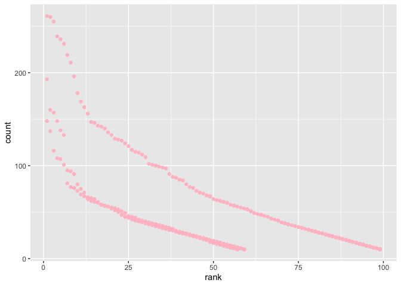

p8105\_hw2\_jl5549
================

Problem 1

``` r
#import Mr Trash Wheel dataset
mr_trash_wheel = 
  read_excel( './data/HealthyHarborWaterWheelTotals2018-7-28.xlsx', 
                            sheet = 'Mr. Trash Wheel') %>% #how to remove non-data entries
  janitor::clean_names() %>% 
  drop_na(dumpster) %>% 
  #way2 filter(is.na(dumpster) == 0)
  #way3 filter(!is.na(dumpster)) 
  mutate(sports_balls = round(sports_balls), 
         sports_balls = as.integer(sports_balls))
```

    ## New names:
    ## * `` -> ...15

``` r
#import percipitation datasets for 2017 and 2018
prcp_2017 = 
  read_excel('./data/HealthyHarborWaterWheelTotals2018-7-28.xlsx', 
                            sheet = 4, skip = 1) %>% 
  janitor::clean_names() %>% 
  drop_na(total) %>% 
  mutate(year = '2017')
prcp_2018 = 
  read_excel('./data/HealthyHarborWaterWheelTotals2018-7-28.xlsx', 
                            sheet = 3, skip = 1) %>% 
  janitor::clean_names() %>% 
  drop_na(total) %>% 
  mutate(year = '2018')

#combine two datasets
prcp = 
  rbind(prcp_2017, prcp_2018) %>% 
  mutate(month = month.name[as.integer(month)])
```

The maximum of trash dumpster collected one day is 5.62 tons. The
maximum of trash dumpster collected one day is 0.96 tons. The total
numbers of plastic bottles collected in 2015 is 1.361310^{5}. The
maximum of precipitation in 2017 is 7.09. The total precipitation in
2018 is 23.5. The median number of sports balls in a dumpster in 2017 is
8.

Problem 2

``` r
#import pols-month dataset
plos_month = read_csv(file = './data/fivethirtyeight_datasets/pols-month.csv') %>% 
  janitor::clean_names() %>% 
  separate(mon, c('year','month','day'), sep = '-', convert = TRUE) %>% 
  
#create a president variable taking values gop and dem
#remove prez_dem, prez_gop and day
  mutate(month = month.name[as.integer(month)],
         president = replace(prez_gop, prez_gop == '1', 'gop'),
        president = replace(president, president == '0', 'dem')) %>% 
  select(-prez_gop, -prez_dem, -day) 
```

    ## Parsed with column specification:
    ## cols(
    ##   mon = col_date(format = ""),
    ##   prez_gop = col_double(),
    ##   gov_gop = col_double(),
    ##   sen_gop = col_double(),
    ##   rep_gop = col_double(),
    ##   prez_dem = col_double(),
    ##   gov_dem = col_double(),
    ##   sen_dem = col_double(),
    ##   rep_dem = col_double()
    ## )

``` r
#import snp.csv dataset
#clean the data in snp.csv using a similar process to the above.
snp = read_csv(file = './data/fivethirtyeight_datasets/snp.csv') %>% 
  janitor::clean_names() %>% 
  separate(date, into = c('month', 'day', 'year'), sep = '/') %>% 
  select(-day, year, month, everything()) %>% 
  arrange(month,year) %>% 
  mutate(month = month.name[as.integer(month)],
    year = as.integer(year))
```

    ## Parsed with column specification:
    ## cols(
    ##   date = col_character(),
    ##   close = col_double()
    ## )

``` r
#import snp.csv dataset
unemployment = read_csv(file = './data/fivethirtyeight_datasets/unemployment.csv') %>% 
  janitor::clean_names() %>% 
  pivot_longer(jan:dec, names_to = 'month', values_to = 'unemployment') %>% 
  mutate(year = as.integer(year))
```

    ## Parsed with column specification:
    ## cols(
    ##   Year = col_double(),
    ##   Jan = col_double(),
    ##   Feb = col_double(),
    ##   Mar = col_double(),
    ##   Apr = col_double(),
    ##   May = col_double(),
    ##   Jun = col_double(),
    ##   Jul = col_double(),
    ##   Aug = col_double(),
    ##   Sep = col_double(),
    ##   Oct = col_double(),
    ##   Nov = col_double(),
    ##   Dec = col_double()
    ## )

``` r
#join datasets
merged_data = full_join(plos_month, snp, by = "year") %>% 
  full_join(unemployment, by = 'year')
```

The first dataset plos\_month contains datas from 1947 to 2015. It
contains 822 rows and 9 variables related to the number of national
politicians who are democratic or republican at any given time. The
president variable indicate whether the president was republican or
democratic on the associated date. The second dataset snp contains datas
from 1950 to 2014. It contains 787 rows and 4 variables related to
representative measure of stock market as a whole. The date variable is
the date of the observation. The close variable is the closing values of
the S\&P stock index on the associated date. The second dataset
unemployment contains datas from 1948 to 2015. It contains 816 rows and
3 variables to indicate the employment rate on a specific date. The last
dataset is a merged on by the three above which shows comprehensive
information related to election of the associated year. It contains
113124 rows and 14 variables

Problem 3

``` r
#import dataset
#convert string variables to lower case
#remove duplicate rows
baby_names = read_csv(file = './data//Popular_Baby_Names.csv') %>% 
  janitor::clean_names() %>% 
  mutate(childs_first_name = str_to_lower(childs_first_name),
          ethnicity = str_to_lower(ethnicity), 
         gender = str_to_lower(gender)) %>% 
  distinct()
```

    ## Parsed with column specification:
    ## cols(
    ##   `Year of Birth` = col_double(),
    ##   Gender = col_character(),
    ##   Ethnicity = col_character(),
    ##   `Child's First Name` = col_character(),
    ##   Count = col_double(),
    ##   Rank = col_double()
    ## )

``` r
baby_names
```

    ## # A tibble: 12,181 x 6
    ##    year_of_birth gender ethnicity              childs_first_na… count  rank
    ##            <dbl> <chr>  <chr>                  <chr>            <dbl> <dbl>
    ##  1          2016 female asian and pacific isl… olivia             172     1
    ##  2          2016 female asian and pacific isl… chloe              112     2
    ##  3          2016 female asian and pacific isl… sophia             104     3
    ##  4          2016 female asian and pacific isl… emily               99     4
    ##  5          2016 female asian and pacific isl… emma                99     4
    ##  6          2016 female asian and pacific isl… mia                 79     5
    ##  7          2016 female asian and pacific isl… charlotte           59     6
    ##  8          2016 female asian and pacific isl… sarah               57     7
    ##  9          2016 female asian and pacific isl… isabella            56     8
    ## 10          2016 female asian and pacific isl… hannah              56     8
    ## # … with 12,171 more rows

``` r
#the rank of “Olivia” over time
olivia = subset(baby_names, childs_first_name == 'olivia', 
                select =c(year_of_birth, ethnicity, rank)) %>% 
  pivot_wider(names_from = 'year_of_birth', values_from = 'rank')

#the most popular male children name over time
male_popular = subset(baby_names, rank == '1' & gender == 'male',
                      select =c(year_of_birth, ethnicity, childs_first_name)) %>% 
  pivot_wider(names_from = 'year_of_birth', values_from = 'childs_first_name')
```

``` r
# scatter plot showing the number of children with a name against the rank in popularity of that name
non_hispanic = subset(baby_names, ethnicity!='hispanic' & gender == 'male' & year_of_birth == '2016', 
       select = c(childs_first_name, rank, count))
ggplot(non_hispanic, aes(x = rank, y = count))+
  geom_point(color = 'pink')
```

<!-- -->
